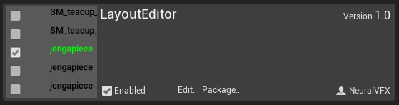
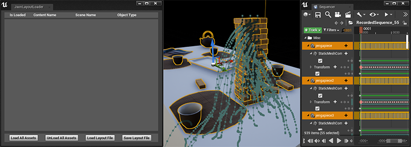
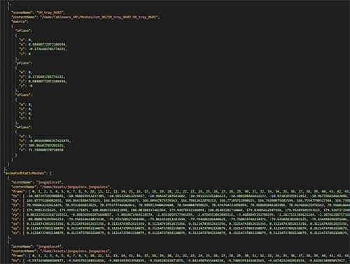
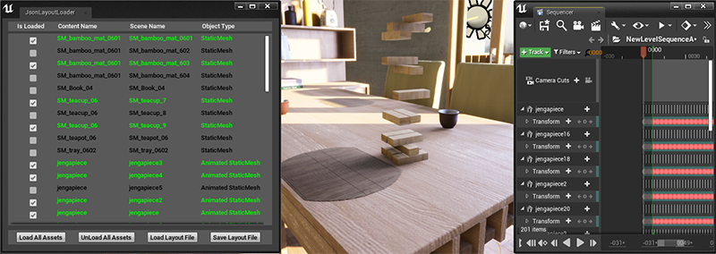
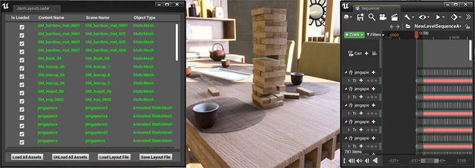

# Getting Started

## Requirements:

- Unreal Engine 4.20.3

## Project Setup

- Make a C++ Unreal Project 
- Make sure you have a `Plugins` folder inside of the project
- Clone this Repo into the plugins folder (Or download the zip file and unzip there)
- Right click your `.uproject` file and click `Generate Visual Studio Project Files`
- Compile the project from Visual Studio
- From `Edit->Plugins`, locate the `Installed` or 'Other' Tab
- Find  `LayoutEditor` and click `Enable`

## Scene Setup

- Make sure that your level has a `LevelSequenceActor` added to it
- Also make sure that your `LevelSequenceActor` has a `LevelSequence` selected
- In the `Content Manager`, navigate to `LayoutEditor Content`
- Right click `JsonLayoutLoader` and click `Run Editor Utility Widget`

## Export a JSON file

- Select whichever static meshes you would like to export
- Click `Save Layout File` and type your filename in

- Meshes with no animation will be stored as a transform
- Meshes with animation in the LevelSequencer will be stored as keyframe values

## Import a JSON file

- Click `Load Layout File` and select your json file
- Assets will be listed with a checkbox in the GUI
- Check or un-check the boxes one by one to load and unload individual objects

- Click `Load All Assets` or `Unload All Assets` to add or remove all objects at once

